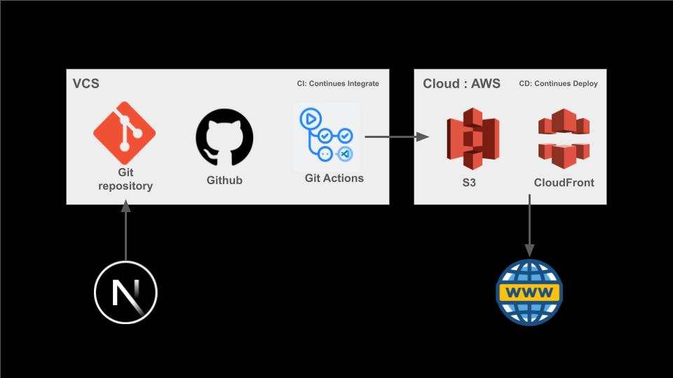

# 프론트엔드 CI/CD 파이프라인




## 주요 링크
* S3 버킷 웹사이트 엔드포인트: http://week-6.s3-website.ap-northeast-2.amazonaws.com
* CloudFront 배포 도메인 : https://d2p5c7rl8kda4v.cloudfront.net/

## 주요 개념
1. GitHub Actions과 CI/CD 도구
    - GitHub Actions는 소프트웨어 개발 라이프사이클의 모든 단계에서 자동화된 워크플로우를 구축할 수 있는 강력한 CI/CD 도구입니다. 코드를 푸시할 때마다 테스트, 빌드, 배포 과정을 자동화할 수 있습니다.
2. S3와 스토리지
    - Amazon S3(Simple Storage Service)는 확장성이 뛰어난 객체 스토리지로, 웹사이트 호스팅, 데이터 백업, 아카이빙 등 다양한 용도로 사용할 수 있습니다.
3. CloudFront와 CDN
    - Amazon CloudFront는 콘텐츠 전송 네트워크(CDN) 서비스로, 전 세계 사용자에게 빠르고 안전하게 콘텐츠를 전달합니다. CloudFront를 통해 S3 버킷에 저장된 정적 파일을 캐시하고 전송 속도를 개선할 수 있습니다.
4. 캐시 무효화(Cache Invalidation)
    - CloudFront의 캐시된 콘텐츠를 무효화하여 최신 파일을 사용자에게 제공하는 과정입니다. 빌드 후 변경된 파일을 배포하기 위해 필요합니다.
5. Repository secret과 환경변수
    - GitHub Actions에서 사용되는 민감한 정보(예: AWS 자격 증명)를 안전하게 저장하고 사용하는 방법입니다. Repository secrets에 환경변수를 설정하여 워크플로우 내에서 보안이 유지된 상태로 사용할 수 있습니다.


## GitHub Action

### GitHub Action이란?
GitHub Action은 빌드, 테스트 및 배포 파이프라인을 자동화할 수 있는 지속적 통합 및 지속적 배포 플랫폼입니다.

### GitHub Actions 채택 이유

#### Background
신규 프로젝트 개발 중이며, 변경사항이 빠르게 일어나는 편입니다. 저희는 지금 신규 서비스를 개발해야 하는 상황이고, 빠르게 CI/CD 시스템을 구축해야 합니다.

#### CI/CD 구축 편의성
Jenkins와 큰 차이점은 GitHub Actions는 별도의 서버 세팅 없이 script 작성으로 구축할 수 있습니다. 클라우드에서 동작하기 때문에 별도의 설치, 서버 세팅이 필요 없어, 그만큼 리소스를 줄일 수 있습니다.

#### 접근성
GitHub 레포지토리 내부에서 yml을 작성하여 workflow를 자동화할 수 있습니다. 또한 GitHub와 호환성이 쉬워, 코드 리뷰, 리뷰어 등록, 코멘트 등록과 같은 자동화를 쉽게 구축할 수 있습니다.

#### 코드 확장성
GitHub Marketplace와 여러 오픈소스 코드를 참고하여 script를 작성할 수 있습니다. 유사한 workflow 세팅이 필요하다면 기존에 작성했던 script 파일을 재사용할 수 있어 시간을 절약할 수 있습니다.

#### 단점/보완점
물론 Jenkins보다 문서가 적지만, GitHub 오픈소스를 통해 여러 scripts를 참고할 수 있습니다. 또한 Jenkins는 캐싱 메커니즘을 지원하기 위해 플러그인을 사용하여 간편하게 구축할 수 있지만, GitHub Action은 직접 캐싱 메커니즘을 작성해야 합니다.

캐싱 메커니즘을 구현하기 위해 리소스가 많이 필요할 수 있지만, 여러 오픈소스를 참고하여 구축한다면 이후 다른 서비스에서 캐싱 메커니즘을 쉽게 구축할 수 있기 때문에 보완할 수 있습니다.

## Action script 분석

### Action trigger
```yaml
on:
  push:
    branches:
      - main
```


현재는 push -> branch가 -> main일 때 실행되도록 설정하였습니다. 실제 서비스를 개발하게 된다면, 바로 main에 push할 일은 없으니 다음과 같이 구축 가능합니다.

```yaml
on:
  pull_request:
    types:
      - opened
      - reopened
      - synchronize
```
pull_request를 생성한 목적은 내 코드가 base 브랜치에 merge되기 위함입니다. 또한 내 코드를 배포하기 위해 코드를 확인하기 위해 PR을 생성합니다. 그러니 pull_request 생성할 때 workflow를 실행시켜 불필요한 workflow 실행 비용을 줄입니다.

### jobs
jobs는 특정 runner에서 실행되는 일련의 step입니다.

```yaml
jobs:
  job_name:
    runs-on: 실행환경
    steps:
      - name: Step1
        run: ~~
      - name: Step2
        run: ~~
```
기본적으로 병렬적으로 실행되고, needs를 사용하여 순차적으로 실행하게 할 수도 있습니다.

```yaml 
jobs:
  build:
    runs-on: ubuntu-latest
    steps:
      - uses: actions/checkout@v4
      - name: Build
        run: npm run build

  test:
    needs: build
    runs-on: ubuntu-latest
    steps:
      - uses: actions/checkout@v4
      - name: Test
        run: npm test
```
현재 구성된 job으로는 deploy(배포)뿐이고 내부에서 세부 스텝별로 배포 과정을 거치고 있습니다. 추후 Lint, test, Lighthouse, GitHub Comment 등 다양한 Job을 추가할 수 있습니다.

### Checkout repository
처음으로 GitHub 저장소의 코드를 워크플로우 실행환경으로 가져옵니다.

```yaml 
- name: Checkout repository
  uses: actions/checkout@v4
```
name은 step 명칭을 뜻하고, uses는 워크플로우를 실행하기 위한 코드 단위인 action을 가져오는 역할입니다. 다른 사람이 만든 액션을 사용하거나 내 저장소에 있는 로컬 액션을 재사용할 수 있게 해줍니다.

### Setup Node.js & Install dependencies & Build
```yaml 
- name: Set up Node.js
  uses: actions/setup-node@v4
  with:
    node-version: "18.x"
- name: Install dependencies
  run: npm ci
- name: Build
  run: npm run build
```
Node.js 환경을 설정합니다. with 구문에서 특정 버전을 지정합니다. 또한 의존성을 설치하고 빌드를 실행합니다. 여기서 선언된 run은 셸에서 실행할 명령어를 지정합니다.

### Configure AWS credentials
AWS CLI를 사용하기 위해 AWS 자격 증명을 설정하는 단계입니다.

```yaml
코드 복사
- name: Configure AWS credentials
  uses: aws-actions/configure-aws-credentials@v1
  with:
    aws-access-key-id: ${{ secrets.AWS_ACCESS_KEY_ID }}
    aws-secret-access-key: ${{ secrets.AWS_SECRET_ACCESS_KEY }}
    aws-region: ${{ secrets.AWS_REGION }}
```
AWS CLI 자격 증명을 설정하기 위해 aws-actions/configure-aws-credentials@v1 액션을 사용합니다. 이때 자격 증명 값은 GitHub Repository > Settings > Secrets에 저장해야 합니다.

### Deploy to S3
빌드된 파일을 S3 버킷에 배포합니다. aws s3 sync 명령어를 사용하여 out/ 폴더 내용을 S3 버킷과 동기화합니다.

```yaml 
- name: Deploy to S3
  run: |
    aws s3 sync out/ s3://${{ secrets.S3_BUCKET_NAME }} --delete
```
--delete 옵션은 소스 디렉토리와 S3 버킷 내용을 비교하여 소스에는 없는 파일을 S3에서 삭제합니다.

### Invalidate CloudFront cache
CloudFront의 캐시를 무효화합니다.

```yaml 
- name: Invalidate CloudFront cache
  run: |
    aws cloudfront create-invalidation --distribution-id ${{ secrets.CLOUDFRONT_DISTRIBUTION_ID }} --paths "/*"
```
aws cloudfront create-invalidation 명령어를 사용하여 지정된 CloudFront 배포의 모든 경로("/*")에 대한 캐시를 무효화합니다. 이는 최신 콘텐츠가 사용자에게 즉시 반영되도록 하기 위해 필요합니다.


--
### 기타사항
#### Next.js 설정 파일 
next.config.mjs에 다음과 같이 설정해야 빌드된 파일이 out/ 폴더에 생성됩니다.
```javascript 
/** @type {import('next').NextConfig} */
const nextConfig = {
  output: "export"
};

export default nextConfig;
```